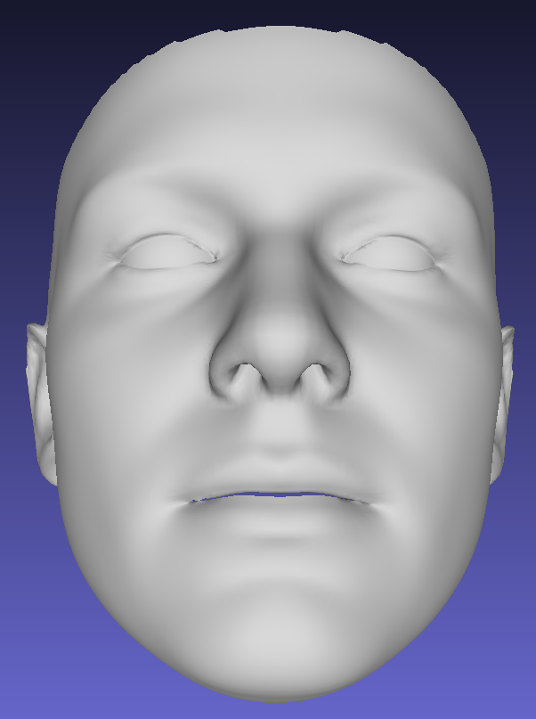
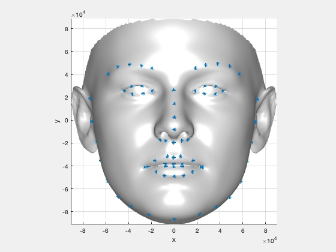

**Todo:** Update the neck-removing processing pipeline from original BFM model.

The original version with neck:

  

The refined version without neck:

  

These two images are rendered by MeshLab.

`bfm_show.m` shows how to render it with 68 keypoints in Matlab.

  

Attention: the z-axis value of `bfm.ply` and `bfm_refine.ply` file are opposed in `model_refine.mat`, do not use these two `ply` file in training.
