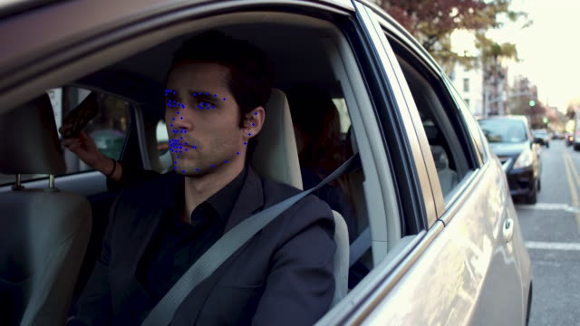

# C++ port

The C++ port of this repo is originally created and contributed by [Ammar Ali](https://github.com/ammarali32), and slightly modified by [cleardusk](https://github.com/cleardusk).
The implementation relies on the new OpenCV (4.2.0+) framework to read onnx and do the inference.

## Foreword

* The implementation is not optimized
* The converted onnx model and the yolo-face detector weights can be downloads in [GoogleDrive](https://drive.google.com/drive/folders/1Iprh93fpGkgebc7rw1OSOEemvxpxFXIB) or [BaiduDrive](https://pan.baidu.com/s/1jSLUK3FEEHf1DE1UqOrO1g) (password: 6kjr)
* Dependency: >= OpenCV 4.2.0
* yolo face detector is tested in this port to substitute dlib (welcome for contributing light-weighted face detector of the c++ port)

## How to build and run

### macOS
```shell script
# Step 1: Install or upgrade OpenCV, the default is 4.4.0. This may take a long long time !!!
brew upgrade opencv # or `brew install opencv` if opencv is not installed

# Step 2: build cpp demo
cd c++ # cd into the c++ dir
mkdir build
cd build
cmake ..
make

# Step 3: put the downloaded weights `mb_1.onnx` and `tiny-yolo-azface-fddb_82000.weights` into `weights` dir

# Run
cd ..
./build/demo
```

### Linux
```shell script
# Step 1: build opencv, >= 4.2.0 will be ok
git clone https://github.com/opencv/opencv.git # you can checkout the desired branch version
cd opencv
mkdir build
cd build
cmake -D CMAKE_BUILD_TYPE=Release -D CMAKE_INSTALL_PREFIX=/usr/local ..
make -j
sudo make install

# Step 2: build cpp demo
cd c++ # cd into the c++ dir
mkdir build
cd build
cmake ..
make

# Step 3: put the downloaded weights `mb_1.onnx` and `tiny-yolo-azface-fddb_82000.weights` into `weights` dir

# Run
cd ..
./build/demo
```

### Result
The result will be stored in `res` by default. Below is a demo running by this c++ port.

<p align="center">
  
</p>


### How about the speed using OpenCV to inference onnx?

When there are two faces, the second face seems to be much faster than the first face, tested on my old MBP (i5-8259U CPU @ 2.30GHz on 13-inch MacBook Pro).

```
$ ./build/demo
Detect: 2 faces
Inference time: 28.3809 ms
Inference time: 6.62105 ms
```

### How to convert the trained model to onnx?
See [convert_to_onnx.py](./convert_to_onnx.py).

### TODO
More functionalities are to be implemented. And welcome for discussions or PRs.
<!-- I hope that I will have time to complete all functionality and not just facial landmarks but i am sure that from here it is not hard to be implemented. -->


