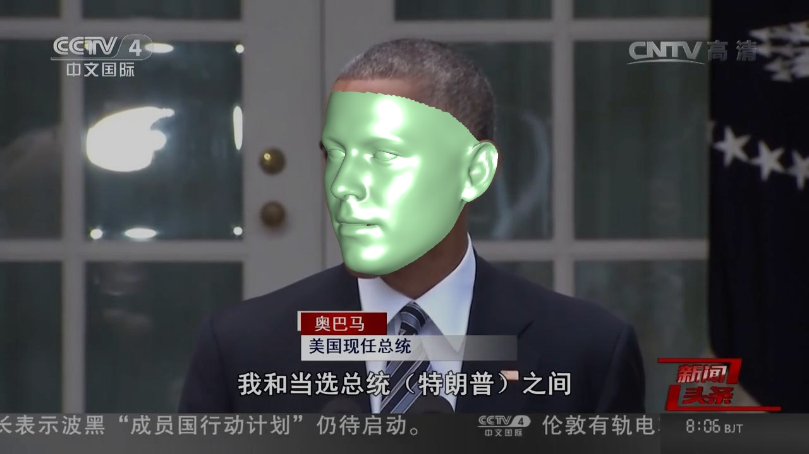
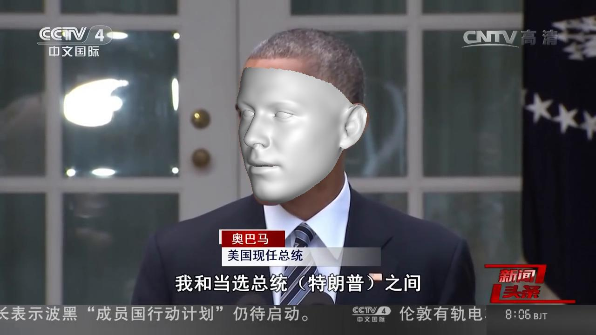

### How to build

1. Prepaing reconstructed 3D dense alignment result

You can download the reconstructed results from [BaiduYun](https://pan.baidu.com/s/1R5Tf1X0b0gLff97G2dKS6w) / [Google Drive](https://drive.google.com/drive/folders/12kNVAxdgomKXfqiJPRmZMA6wexVPaNIh?usp=sharing) or run `main.py` in the root directory.

2. Run `rendering.m` to rendering 3D face meshes. The rendered images will be in `obama_res@dense` directory.

3. Run `python3 convert_imgs_to_video.py obama_res@dense` to convert images to one video.

A frame of the video:
<p align="center">
  
</p>

The output video named `obama_res@dense.mp4` lies in this directory.


### A simple Python render

_Thanks for [liguohao96](https://github.com/liguohao96) for contributions of the original version of this simple Python render._

**Speed**: ~25ms for one frame (720p), CPU.


After preparing the vertices, just run
```
python3 rendering.py && python3 convert_imgs_to_video.py obama_res@dense_py
```

A frame of the outputed video:
<p align="center">
  
</p>

The output video named `obama_res@dense_py.mp4` lies in this directory.

### Future
**Welcome for contributions of a FASTer Python/PyTorch render.**
