# Face Alignment in Full Pose Range: A 3D Total Solution
[](LICENSE)
[](http://hits.dwyl.io/cleardusk/3DDFA)


By [Jianzhu Guo](https://guojianzhu.com/aboutme.html).

<p align="center">
  
</p>

**\[Updates\]**

 - `2019.9.15`: Some updates, see the commits for details.
 - `2019.6.17`: Adding a [video demo](./video_demo.py) contributed by [zjjMaiMai](https://github.com/zjjMaiMai).
 - `2019.5.2`: Evaluating inference speed on CPU with PyTorch v1.1.0, see [here](#CPU) and [speed_cpu.py](./speed_cpu.py).
 - `2019.4.27`: A simple render pipline running at ~25ms/frame (720p), see [rendering.py](demo@obama/rendering.py) for more details.
 - `2019.4.24`: Providing the demo building of obama, see [demo@obama/readme.md](demo@obama/readme.md) for more details.
 - `2019.3.28`: Some updates.
 - `2018.12.23`: **Add several features: depth image estimation, PNCC, PAF feature and obj serialization.** See `dump_depth`, `dump_pncc`, `dump_paf`, `dump_obj` options for more details.
 - `2018.12.2`: Support landmark-free face cropping, see `dlib_landmark` option.
 - `2018.12.1`: Refine code and add pose estimation feature, see [utils/estimate_pose.py](./utils/estimate_pose.py) for more details.
 - `2018.11.17`: Refine code and map the 3d vertex to original image space.
 - `2018.11.11`: **Update end-to-end inference pipeline: infer/serialize 3D face shape and 68 landmarks given one arbitrary image, please see readme.md below for more details.**
 - `2018.10.4`: Add Matlab face mesh rendering demo in [visualize](./visualize).
 - `2018.9.9`: Add pre-process of face cropping in [benchmark](./benchmark).

**\[Todo\]**

- [x] Depth image estimation.
- [x] PNCC (Projected Normalized Coordinate Code).
- [x] PAF (Pose Adaptive Feature).
- [x] Obj serialization with sampled texture.
- [x] Recommendation of fast face detectors: [FaceBoxes.PyTorch](https://github.com/zisianw/FaceBoxes.PyTorch), [libfacedetection](https://github.com/ShiqiYu/libfacedetection), [ZQCNN](https://github.com/zuoqing1988/ZQCNN)
- [x] [Training details](#Training-details)
- [x] Face Profiling: [Official Matlab code](http://www.cbsr.ia.ac.cn/users/xiangyuzhu/projects/3DDFA/Code/FaceProfilingRelease_v1.1.zip)

## Introduction
This repo holds the pytorch improved version of the paper: [Face Alignment in Full Pose Range: A 3D Total Solution](https://arxiv.org/abs/1804.01005). Several works beyond the original paper are added, including the real-time training, training strategies. Therefore, this repo is an improved version of the original work. As far, this repo releases the pre-trained first-stage pytorch models of MobileNet-V1 structure, the pre-processed training&testing dataset and codebase. Note that the inference time is about **0.27ms per image** (input batch with 128 images as an input batch) on GeForce GTX TITAN X.
<!-- Note that if your academic work use the code of this repo, you should cite this repo not the original paper.-->
<!-- One related blog will be published for some important technique details in future. -->
<!-- Why not evaluate it on single image? Because most time for single image is spent on function call. The inference speed is equal to MobileNet-V1 with 120x120x3 tensor as input, therefore it is possible to convert to mobile devices. -->

**This repo will keep updating in my spare time, and any meaningful issues and PR are welcomed.**

Several results on ALFW-2000 dataset (inferenced from model *phase1_wpdc_vdc.pth.tar*) are shown below.
<p align="center">
  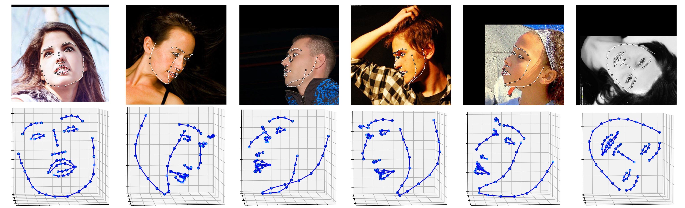
</p>

<p align="center">
  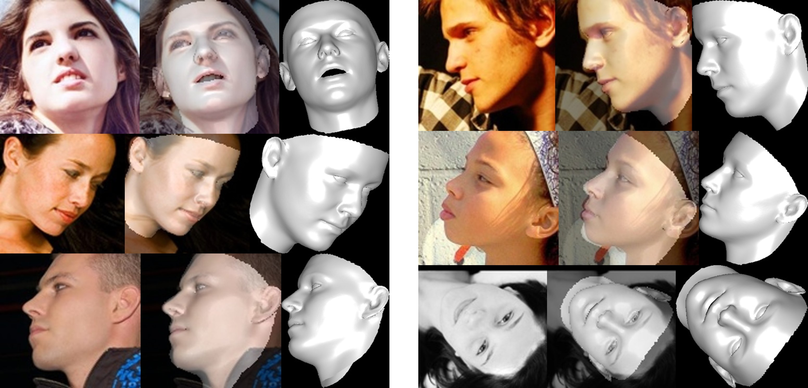
</p>

## Applications & Features
#### 1. Face Alignment
<p align="center">
  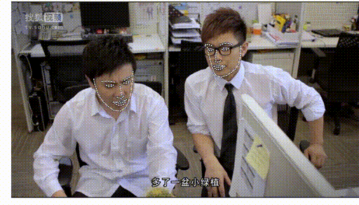
</p>

#### 2. Face Reconstruction
<p align="center">
  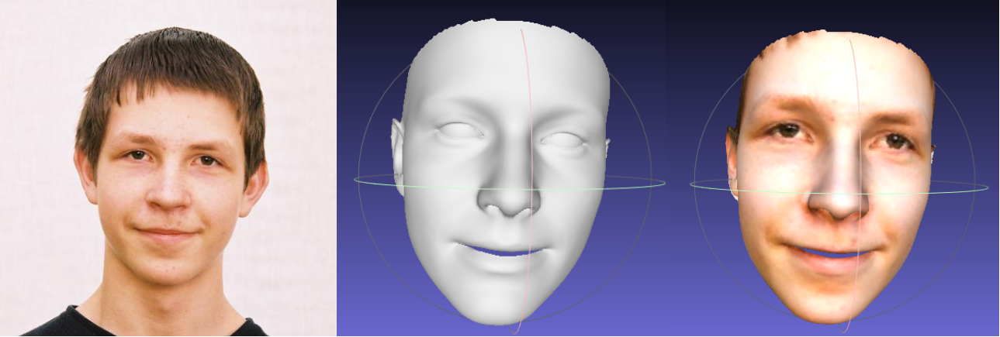
</p>

#### 3. 3D Pose Estimation
<p align="center">
  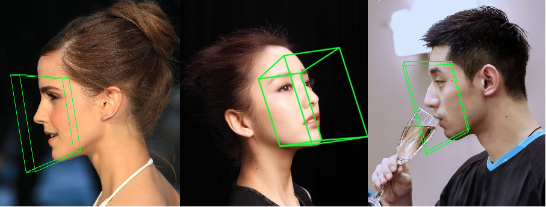
</p>

#### 4. Depth Image Estimation
<p align="center">
  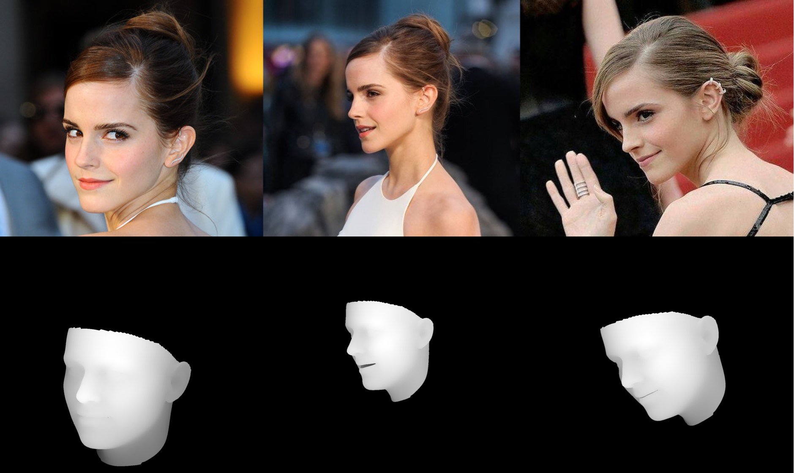
</p>

#### 5. PNCC & PAF Features
<p align="center">
  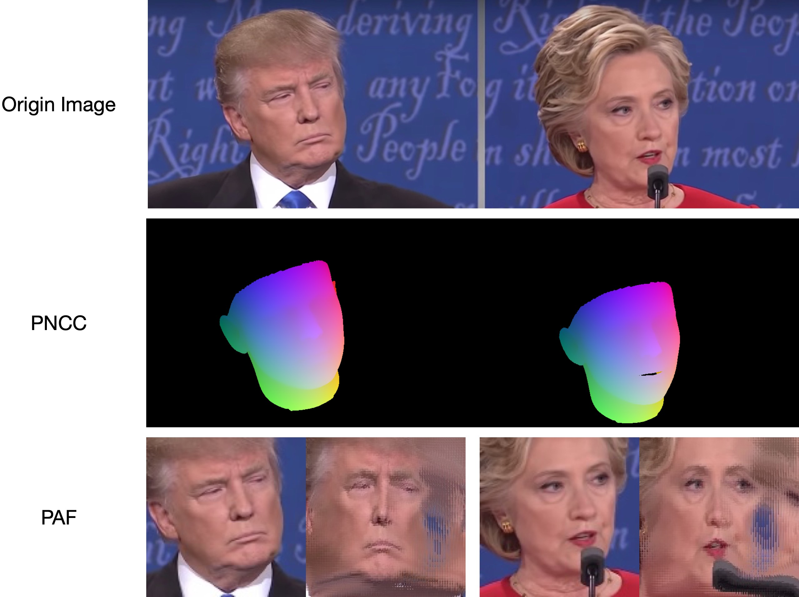
</p>

## Getting started
### Requirements
 - PyTorch >= 0.4.1 (**PyTorch v1.1.0** is tested successfully on macOS and Linux.)
 - Python >= 3.6 (Numpy, Scipy, Matplotlib)
 - Dlib (Dlib is optionally for face and landmarks detection. There is no need to use Dlib if you can provide face bouding bbox and landmarks. Besides, you can try the two-step inference strategy without initialized landmarks.)
 - OpenCV (Python version, for image IO opertations.)
 - Cython (For accelerating depth and PNCC render.)
 - Platform: Linux or macOS (Windows is not tested.)

 ```
 # installation structions
 sudo pip3 install torch torchvision # for cpu version. more option to see https://pytorch.org
 sudo pip3 install numpy scipy matplotlib
 sudo pip3 install dlib==19.5.0 # 19.15+ version may cause conflict with pytorch in Linux, this may take several minutes
 sudo pip3 install opencv-python
 sudo pip3 install cython
 ```

In addition, I strongly recommend using Python3.6+ instead of older version for its better design.

### Usage

1. Clone this repo (this may take some time as it is a little big)
    ```
    git clone https://github.com/cleardusk/3DDFA.git  # or git@github.com:cleardusk/3DDFA.git
    cd 3DDFA
    ```

   Then, download dlib landmark pre-trained model in [Google Drive](https://drive.google.com/open?id=1kxgOZSds1HuUIlvo5sRH3PJv377qZAkE) or [Baidu Yun](https://pan.baidu.com/s/1bx-GxGf50-KDk4xz3bCYcw), and put it into `models` directory. (To reduce this repo's size, I remove some large size binary files including this model, so you should download it : ) )


2. Build cython module (just one line for building)
   ```
   cd utils/cython
   python3 setup.py build_ext -i
   ```
   This is for accelerating depth estimation and PNCC render since Python is too slow in for loop.
   
    
3. Run the `main.py` with arbitrary image as input
    ```
    python3 main.py -f samples/test1.jpg
    ```
    If you can see these output log in terminal, you run it successfully.
    ```
    Dump tp samples/test1_0.ply
    Save 68 3d landmarks to samples/test1_0.txt
    Dump obj with sampled texture to samples/test1_0.obj
    Dump tp samples/test1_1.ply
    Save 68 3d landmarks to samples/test1_1.txt
    Dump obj with sampled texture to samples/test1_1.obj
    Dump to samples/test1_pose.jpg
    Dump to samples/test1_depth.png
    Dump to samples/test1_pncc.png
    Save visualization result to samples/test1_3DDFA.jpg
    ```

    Because `test1.jpg` has two faces, there are two `.ply` and `.obj` files (can be rendered by Meshlab or Microsoft 3D Builder) predicted. Depth, PNCC, PAF and pose estimation are all set true by default. Please run `python3 main.py -h` or review the code for more details.

    The 68 landmarks visualization result `samples/test1_3DDFA.jpg` and pose estimation result `samples/test1_pose.jpg` are shown below:

<p align="center">
  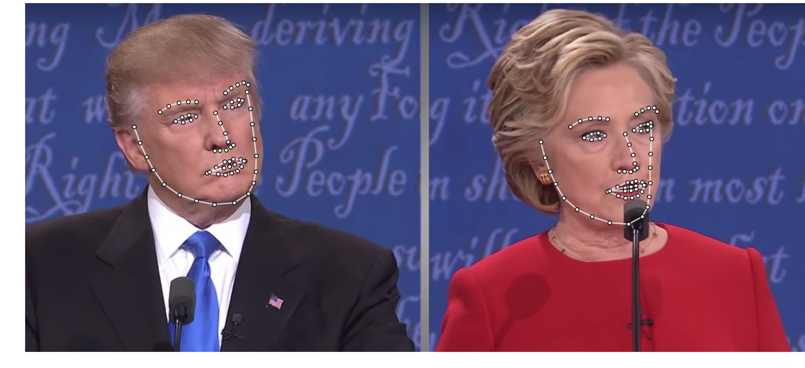
</p>

<p align="center">
  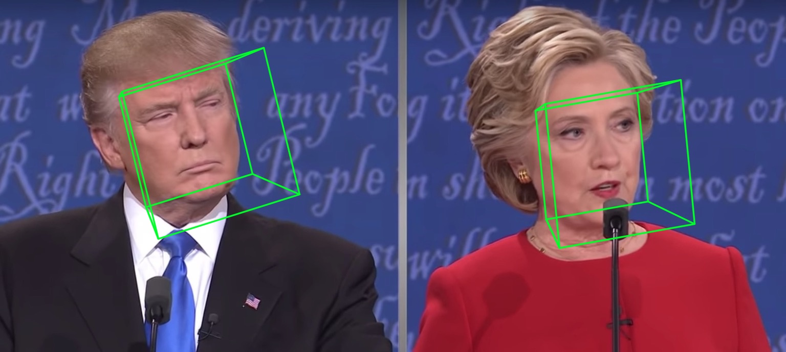
</p>

4. Additional example

    ```
    python3 ./main.py -f samples/emma_input.jpg --bbox_init=two --dlib_bbox=false
    ```

<p align="center">
  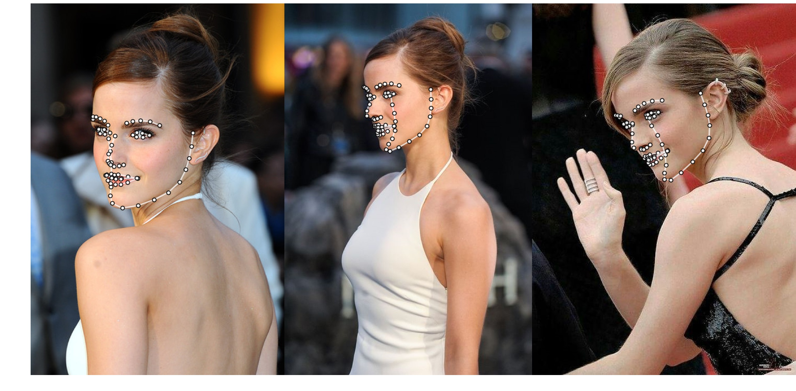
</p>

<p align="center">
  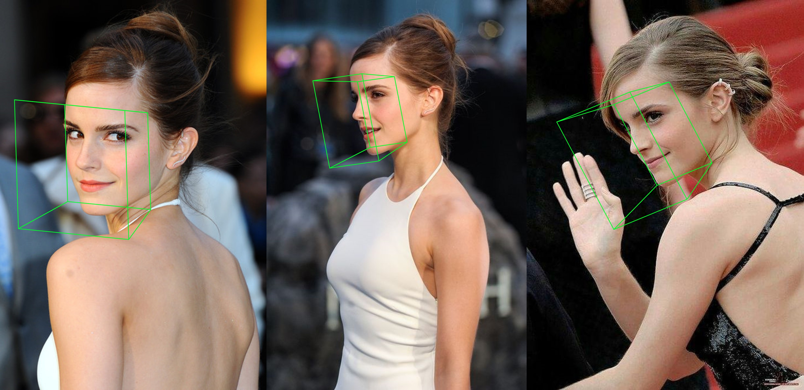
</p>

## Citation
    @article{zhu2017face,
      title={Face Alignment in Full Pose Range: A 3D Total Solution},
      author={Zhu, Xiangyu and Lei, Zhen and Li, Stan Z and others},
      journal={IEEE Transactions on Pattern Analysis and Machine Intelligence},
      year={2017},
      publisher={IEEE}
    }

    @misc{3ddfa_cleardusk,
      author =       {Jianzhu Guo, Xiangyu Zhu and Zhen Lei},
      title =        {3DDFA},
      howpublished = {\url{https://github.com/cleardusk/3DDFA}},
      year =         {2018}
    }

    
## Inference speed
### CPU
Just run
```
python3 speed_cpu.py
```

On my MBP (i5-8259U CPU @ 2.30GHz on 13-inch MacBook Pro), based on **PyTorch v1.1.0**, with a single input, the running output is:
```
Inference speed: 14.50±0.11 ms
```

<!-- [speed_cpu.py](./speed_cpu.py) -->


### GPU
When input batch size is 128, the total inference time of MobileNet-V1 takes about 34.7ms. The average speed is about **0.27ms/pic**.

<p align="center">
  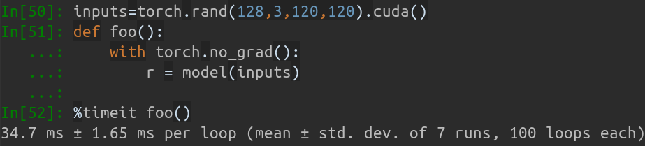
</p>

## Training details
The training scripts lie in `training` directory. The related resources are in below table.

| Data | Download Link | Description |
|:-:|:-:|:-:|
| train.configs | [BaiduYun](https://pan.baidu.com/s/1ozZVs26-xE49sF7nystrKQ) or [Google Drive](https://drive.google.com/open?id=1dzwQNZNMppFVShLYoLEfU3EOj3tCeXOD), 217M | The directory contraining 3DMM params and filelists of training dataset |
| train_aug_120x120.zip | [BaiduYun](https://pan.baidu.com/s/19QNGst2E1pRKL7Dtx_L1MA) or [Google Drive](https://drive.google.com/open?id=17LfvBZFAeXt0ACPnVckfdrLTMHUpIQqE), 2.15G | The cropped images of augmentation training dataset |
| test.data.zip | [BaiduYun](https://pan.baidu.com/s/1DTVGCG5k0jjjhOc8GcSLOw) or [Google Drive](https://drive.google.com/file/d/1r_ciJ1M0BSRTwndIBt42GlPFRv6CvvEP/view?usp=sharing), 151M | The cropped images of AFLW and ALFW-2000-3D testset |

After preparing the training dataset and configuration files, go into `training` directory and run the bash scripts to train. `train_wpdc.sh`, `train_vdc.sh` and `train_pdc.sh` are examples of training scripts. After configuring the training and testing sets, just run them for training. Take `train_wpdc.sh` for example as below:

```
#!/usr/bin/env bash

LOG_ALIAS=$1
LOG_DIR="logs"
mkdir -p ${LOG_DIR}

LOG_FILE="${LOG_DIR}/${LOG_ALIAS}_`date +'%Y-%m-%d_%H:%M.%S'`.log"
#echo $LOG_FILE

./train.py --arch="mobilenet_1" \
    --start-epoch=1 \
    --loss=wpdc \
    --snapshot="snapshot/phase1_wpdc" \
    --param-fp-train='../train.configs/param_all_norm.pkl' \
    --param-fp-val='../train.configs/param_all_norm_val.pkl' \
    --warmup=5 \
    --opt-style=resample \
    --resample-num=132 \
    --batch-size=512 \
    --base-lr=0.02 \
    --epochs=50 \
    --milestones=30,40 \
    --print-freq=50 \
    --devices-id=0,1 \
    --workers=8 \
    --filelists-train="../train.configs/train_aug_120x120.list.train" \
    --filelists-val="../train.configs/train_aug_120x120.list.val" \
    --root="/path/to//train_aug_120x120" \
    --log-file="${LOG_FILE}"
```

The specific training parameters are all presented in bash scripts, including learning rate, mibi-batch size, epochs and so on.

## Evaluation
First, you should download the cropped testset ALFW and ALFW-2000-3D in [test.data.zip](https://pan.baidu.com/s/1DTVGCG5k0jjjhOc8GcSLOw), then unzip it and put it in the root directory.
Next, run the benchmark code by providing trained model path.
I have already provided five pre-trained models in `models` directory (seen in below table). These models are trained using different loss in the first stage. The model size is about 13M due to the high efficiency of MobileNet-V1 structure.
```
python3 ./benchmark.py -c models/phase1_wpdc_vdc.pth.tar
```

The performances of pre-trained models are shown below. In the first stage, the effectiveness of different loss is in order: WPDC > VDC > PDC. While the strategy using VDC to finetune WPDC achieves the best result.

| Model | AFLW (21 pts) | AFLW 2000-3D (68 pts) | Download Link |
|:-:|:-:|:-:| :-: |
| *phase1_pdc.pth.tar*  | 6.956±0.981 | 5.644±1.323 | [Baidu Yun](https://pan.baidu.com/s/1xeyZa4rxVazd_QGWx6QXFw) or [Google Drive](https://drive.google.com/open?id=18UQfDkGNzotKoFV0Lh_O-HnXsp1ABdjl) |
| *phase1_vdc.pth.tar*  | 6.717±0.924 | 5.030±1.044 | [Baidu Yun](https://pan.baidu.com/s/10-0YpYKj1_efJYqC1q-aNQ) or [Google Drive](https://drive.google.com/open?id=1iHADYNIQR2Jqvt4nwmnh5n3Axe-HXMRR) |
| *phase1_wpdc.pth.tar* | 6.348±0.929 | 4.759±0.996 | [Baidu Yun](https://pan.baidu.com/s/1yqaJ3S3MNpYBgyA5BYtHuw) or [Google Drive](https://drive.google.com/open?id=1ebwkOWjaQ7U4mpA89ldfmjeQdfDDdFS-) |
| *phase1_wpdc_vdc.pth.tar* | **5.401±0.754** | **4.252±0.976** | In this repo. |

## FQA
1. Face bounding box initialization

    The original paper shows that using detected bounding box instead of ground truth box will cause a little performance drop. Thus the current face cropping method is robustest. Quantitative results are shown in below table.

<p align="center">
  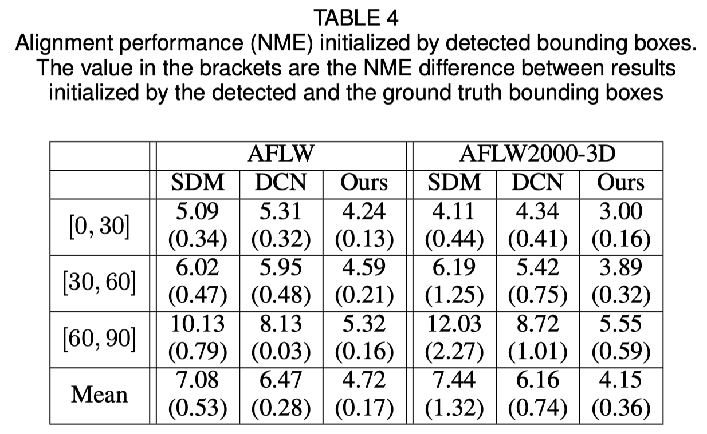
</p>

2. Face reconstruction
   
   The texture of non-visible area is distorted due to self-occlusion, therefore the non-visible face region may appear strange (a little horrible).

## Acknowledgement
 - Thanks for [Yao Feng](https://github.com/YadiraF)'s fantastic works [PRNet](https://github.com/YadiraF/PRNet) and [face3d](https://github.com/YadiraF/face3d).
 - Thanks for this [tweet](https://twitter.com/PyTorch/status/1066064914249367552) of PyTorch.
 - This project is partially supervised by [Xiangyu Zhu](http://www.cbsr.ia.ac.cn/users/xiangyuzhu/) and [Zhen Lei](http://www.cbsr.ia.ac.cn/users/zlei/).


Thanks for your interest in this repo. If your work or research benefit from this repo, please cite it, star it and popularize it 😃

Welcome to focus on my 3D face related works: [MeGlass](https://github.com/cleardusk/MeGlass) and [Face Anti-Spoofing](https://arxiv.org/abs/1901.00488).

## Contact
**Jianzhu Guo (郭建珠)** [[Homepage](https://guojianzhu.com), [Google Scholar](https://scholar.google.com/citations?user=W8_JzNcAAAAJ&hl=en&oi=ao)]:  **jianzhu.guo@nlpr.ia.ac.cn**. 
