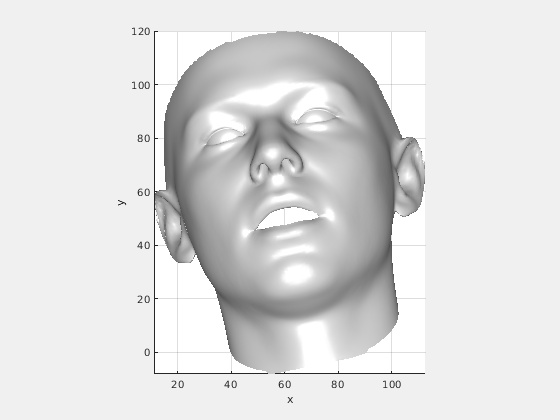

`image00427.mat` is generated by `visualize.py` in root directory. `render_demo.m` is a simple matlab demo to render 3D face mesh.

`tri.mat` provides the 3D mesh triangle indices.

The rendered result:

